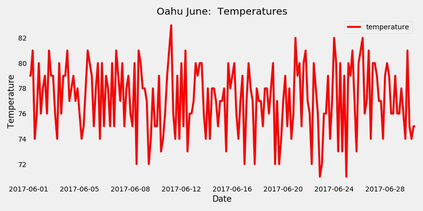

# Surfs_Up
**Using Python, SQLalchemy and Flask to analyze and visualize Maui climate data in order to determine feasibility of new surf and ice cream shop.**

### Contents: 

1. Project Description.
2. Weather Analysis.
3. Recommendations
4. List of attachments.

### 1 -Project Description.  

The overall objective is to analyze weather data in Oahu to help determine the feasibility of opening a new surf and ice cream shop.  The potential owners want enough information to make a good decision as to whether they should open a new shop.

Specifically, this analysis compares weather between the months of June 2017 and November 2016.

The technical objectives are to use SQLAlchemy, Python and a provided SQLLite database of Oahu weather to run the analysis.  

### 2 -Weather Analysis. 

###### Analysis of Rain differences

- The average(mean) rain between June and November is about same at 0 .12 inches.
- Average daily run in June varies by a standard deviation (std) of 0.2 inches while in November the std is 0.34 inches. This means that in June it is not uncommon to have days with twice the daily average rain while in  November it is not uncommon to have three times the average daily rain.
- In both months, half the days have less than 0.02 inches of rain.
- 75% of the days in June have less than a 0.15 inches while in November 75% of the days have less than 0.09 inches. which means that it rains more frequently in June, but the storms are stronger in November.
- Overall I would say in both months the rain is not a big factor on most days.  In June there are regular small rain storms while in November most days are dryer but the storms are more powerful.
- Potentially, during bad stormy days in November the rain could very well affect business.

##### Analysis of Temperature Differences

- Average temperature in June is 77 degrees while November is 74. This is a very small difference between the two months.
- The standard deviation comparisons indicate that the a normal variance for November is 2.8 degrees while its 2.6 degrews in June. This is also another small difference  indicating a slightly greater variance in daily temperatures for November 
- Noticeable  differences in temperature between months are seen at the extremes. 
  - November can be as cold as 63 degrees with a high of 80, while June low is only 71, with max of 83.
  - So the temp in June varies within a range of 12 degrees  while the November range is 17 degrees where the low of 63 is 11 degress below average.
- Overall, temperature in June and November tends to stay in the 70s with highs varying by six degrees above average in both months, and the lows in November dipping by a greater margin than June, to 63 degrees.

!{}(Images/Oahu June Temperatures.png)

##### June Weather Statistics

##### November Weather Statistics

### 3 - Recommendations. 

Both months produce comfortable weather ranging from 63 to 83 degrees with regular small amounts of rain in June and less regular but heavier rain in November.

Recommend  1. Drilling deeper into  the data by Station and plotting the Stations weather data on a map. Oahu is big island and topographically varied island and so there may be significant weather differences by Station that should be accounted for. 

Recommend 2 - Given the occasional relatively heavy storms in November, it would be good to define a threshold of how much rain per day is expected to impact business, then do additional analysis focused on those days that meet the rain threshold, using year long data.

Additional analysis should be done by department. For each department we should identify the number of retiring folks and the number of available mentors, as the percentage difference is likely to vary by department. In short, more analysis by department may lead to discover that different staffing strategies will be needed by different departments.

### 4 -List of Attachments

**Scripts and data.** 

1. climate_analysis.ipynb contains the python code for this analysis.
2. hawaii.sqlite is the Sqlite database.

###### Images. 

1. June Weather Statistics.png.  Statistics for June weather data.
2. November Weather Statistics.png. Statistics for November data.
